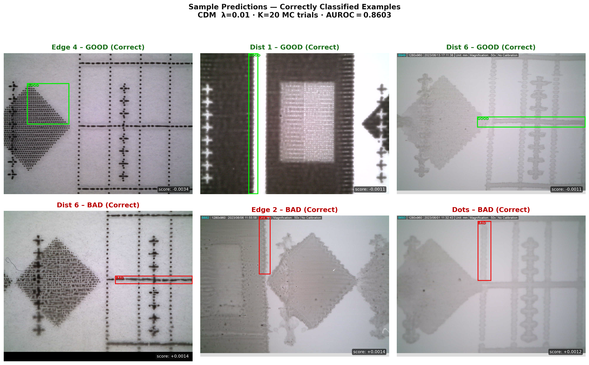
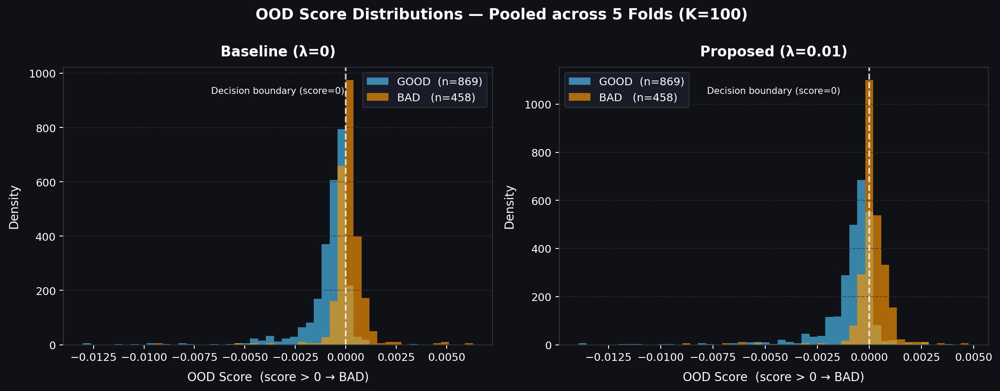
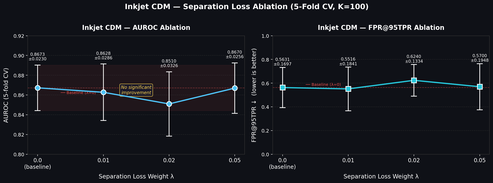
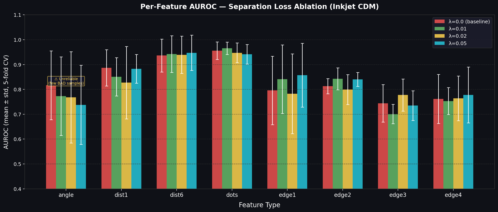
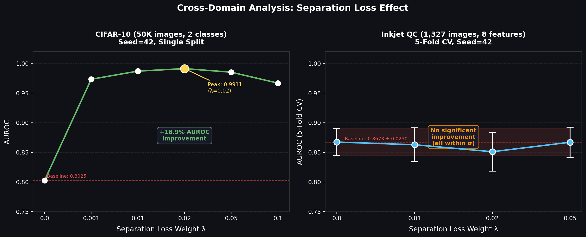

<div align="center">

# InkjetOOD

**Conditional Diffusion Models for Inkjet Print Quality Control**

[](https://www.python.org/downloads/)
[](https://pytorch.org/)
[](https://docs.ultralytics.com/)
[](https://huggingface.co/ahmed-3m/InkjetOOD)
[](https://doi.org/10.5281/zenodo.11444566)
[](LICENSE)

[Overview](#overview) · [Dataset](#dataset) · [How It Works](#how-it-works) · [Results](#results) · [Quick Start](#quick-start) · [Reproduction Guide](REPRODUCTION.md) · [Citation](#citation)

</div>

<p align="center">
  
</p>

---

## Overview

This repository implements a crop-based conditional diffusion model (CDM) for out-of-distribution detection in inkjet print quality control. A YOLOv8 detector first localises eight print features, then a multi-head UNet scores each crop using diffusion reconstruction error.

The key property is label efficiency: the CDM is trained on good print samples and used to detect defective or distribution-shifted crops at inference time. The final thesis protocol uses 5-fold stratified cross-validation on the public FTI_Zer0P inkjet dataset.

Primary result: the best 5-fold CV model is the λ=0 baseline, with **0.8673 ± 0.0230 AUROC** across folds. Separation loss helps strongly in the paired CIFAR-10 study, but on this small industrial dataset no non-zero λ value significantly outperforms the baseline.

---

## Dataset

This repository uses the public **FTI_Zer0P inkjet print dataset** released by PROFACTOR on Zenodo:

- Dataset page: [https://zenodo.org/records/11444566](https://zenodo.org/records/11444566)
- DOI: [10.5281/zenodo.11444566](https://doi.org/10.5281/zenodo.11444566)
- Dataset licence: **Creative Commons Attribution 4.0 International (CC BY 4.0)**

The dataset is not bundled in this Git repository. Download it from Zenodo, extract it locally, and point the code to it with `INKJET_DATA_DIR`.

Expected metadata file:

```text
metadata.csv
```

Required `metadata.csv` schema:

| Column | Description |
|--------|-------------|
| `file_name` | Relative image or crop filename. |
| `label` | Binary quality label: `1=GOOD`, `0=BAD`. |
| `feature` | Inkjet feature type, such as dots, distance, angle, or edge region. |

The code in this repository is released under the MIT licence. The FTI_Zer0P dataset remains under CC BY 4.0 and should be cited separately when used.

---

## How It Works

1. **Detect features** with YOLOv8: dots, distances, angle, and edge-roughness regions are cropped from the print image.
2. **Condition the CDM** on structured metadata: template, feature type, quality condition, and bounding-box geometry.
3. **Score OOD crops** by adding noise at sampled timesteps and comparing denoising/reconstruction behaviour under the diffusion model.
4. **Aggregate metrics** across folds and features to evaluate robustness under class imbalance and small-sample industrial constraints.

<p align="center">
  
</p>

---

## Results

### Separation-Loss Ablation

<p align="center">
  
</p>

<div align="center">
<table>
  <thead>
    <tr>
      <th>λ</th>
      <th>AUROC ↑</th>
      <th>Accuracy ↑</th>
      <th>FPR@95TPR ↓</th>
    </tr>
  </thead>
  <tbody>
    <tr><td><strong>0.0 (baseline)</strong></td><td><strong>0.8673 ± 0.0230</strong></td><td><strong>0.8094 ± 0.0151</strong></td><td>0.5631 ± 0.1697</td></tr>
    <tr><td>0.01</td><td>0.8628 ± 0.0286</td><td>0.7928 ± 0.0291</td><td><strong>0.5516 ± 0.1841</strong></td></tr>
    <tr><td>0.02</td><td>0.8510 ± 0.0326</td><td>0.8003 ± 0.0246</td><td>0.6240 ± 0.1334</td></tr>
    <tr><td>0.05</td><td>0.8670 ± 0.0256</td><td>0.8071 ± 0.0241</td><td>0.5700 ± 0.1948</td></tr>
  </tbody>
</table>
</div>

The CV result is the thesis headline for InkjetOOD: λ=0 remains slightly best, and the small differences between λ values are within cross-fold variation.

### Per-Feature AUROC

<p align="center">
  
</p>

<div align="center">
<table>
  <thead>
    <tr>
      <th>Feature</th>
      <th>λ=0.0</th>
      <th>λ=0.01</th>
      <th>λ=0.02</th>
      <th>λ=0.05</th>
    </tr>
  </thead>
  <tbody>
    <tr><td>Angle</td><td><strong>0.8166 ± 0.1381</strong></td><td>0.7727 ± 0.1580</td><td>0.7682 ± 0.1836</td><td>0.7378 ± 0.1593</td></tr>
    <tr><td>Distance 1</td><td><strong>0.8866 ± 0.0729</strong></td><td>0.8508 ± 0.0768</td><td>0.8274 ± 0.1457</td><td>0.8828 ± 0.0581</td></tr>
    <tr><td>Distance 6</td><td>0.9362 ± 0.0666</td><td>0.9423 ± 0.0737</td><td>0.9393 ± 0.0750</td><td><strong>0.9473 ± 0.0710</strong></td></tr>
    <tr><td>Dots</td><td>0.9557 ± 0.0353</td><td><strong>0.9655 ± 0.0247</strong></td><td>0.9474 ± 0.0400</td><td>0.9413 ± 0.0394</td></tr>
    <tr><td>Edge 1</td><td>0.7958 ± 0.1376</td><td>0.8410 ± 0.1379</td><td>0.7823 ± 0.1607</td><td><strong>0.8574 ± 0.1283</strong></td></tr>
    <tr><td>Edge 2</td><td>0.8129 ± 0.0307</td><td><strong>0.8426 ± 0.0443</strong></td><td>0.7993 ± 0.0602</td><td>0.8402 ± 0.0283</td></tr>
    <tr><td>Edge 3</td><td>0.7441 ± 0.0757</td><td>0.7008 ± 0.0390</td><td><strong>0.7774 ± 0.0647</strong></td><td>0.7349 ± 0.0596</td></tr>
    <tr><td>Edge 4</td><td>0.7617 ± 0.0985</td><td>0.7529 ± 0.0543</td><td>0.7643 ± 0.0898</td><td><strong>0.7775 ± 0.1125</strong></td></tr>
  </tbody>
</table>
</div>

Dots and distance features are easiest; edge roughness remains harder and more variable. Angle has very few BAD samples per fold, so its AUROC has high variance.

### Cross-Domain Lesson

<p align="center">
  
</p>

<div align="center">
<table>
  <thead>
    <tr>
      <th>Dataset</th>
      <th>Baseline (λ=0)</th>
      <th>Best separation-loss setting</th>
      <th>Δ AUROC</th>
    </tr>
  </thead>
  <tbody>
    <tr><td>CIFAR-10</td><td>0.925 ± 0.111</td><td><strong>0.9903 ± 0.0007 (λ=0.02)</strong></td><td><strong>+6.5 pp</strong></td></tr>
    <tr><td>Inkjet QC</td><td><strong>0.8673 ± 0.0230</strong></td><td>0.8670 ± 0.0256 (λ=0.05)</td><td>≈0.0 pp (n.s.)</td></tr>
  </tbody>
</table>
</div>

This is the main boundary condition from the industrial transfer study: separation loss is valuable when class-conditional reconstruction distributions can be pulled apart, but it does not automatically improve small, fine-grained manufacturing datasets.

---

## Pretrained Weights

Weights are hosted on Hugging Face: [ahmed-3m/InkjetOOD](https://huggingface.co/ahmed-3m/InkjetOOD)

<div align="center">
<table>
  <thead>
    <tr>
      <th>File</th>
      <th>Description</th>
      <th>Result</th>
      <th>Params</th>
    </tr>
  </thead>
  <tbody>
    <tr><td><code>models/cdm_v3_baseline.pt</code></td><td>CDM λ=0, base_ch=128</td><td>0.8673 ± 0.0230 CV AUROC</td><td>34.2 M</td></tr>
    <tr><td><code>models/cdm_v3_yolo_bbox.pt</code></td><td>CDM λ=0.01, base_ch=64</td><td>0.8603 single-split AUROC</td><td>9.33 M</td></tr>
    <tr><td><code>models/yolo_best.pt</code></td><td>YOLOv8 feature detector</td><td>0.950 mAP@50</td><td>25.86 M</td></tr>
    <tr><td><code>semantic_mismatch_*.pt</code></td><td>Per-feature CDM checkpoints</td><td>feature-specific AUROC</td><td>8.94 M each</td></tr>
  </tbody>
</table>
</div>

---

## Quick Start

### Installation

```bash
git clone https://github.com/ahmed-3m/InkjetOOD.git
cd InkjetOOD
pip install -r requirements.txt
```
Download pretrained weights:

```bash
python download_weights.py
```

Set the dataset path:

```bash
export INKJET_DATA_DIR=/path/to/FTI_Zer0P_dataset
```

The directory should contain the extracted Zenodo dataset and its `metadata.csv` file with the schema described in [Dataset](#dataset).

### Evaluate A Pretrained Checkpoint

```bash
python evaluate.py \
    --checkpoint models/cdm_proposed.pt \
    --num_trials 100 \
    --out_dir results/eval_pretrained
```

### Run The Thesis CV Protocol

```bash
CUDA_VISIBLE_DEVICES=0 python run_cv.py \
    --epochs 100 \
    --batch_size 128 \
    --sep_loss_weight 0.0 \
    --num_trials 100 \
    --n_folds 5 \
    --seed 42 \
    --out_dir results/cv_lambda0
```

For the full step-by-step guide, see [REPRODUCTION.md](REPRODUCTION.md).

---

## Configuration

<details>
<summary>Key hyperparameters</summary>

| Parameter | Default | Description |
|-----------|---------|-------------|
| `SEP_LOSS_WEIGHT` | `0.01` | Single-split λ default; use `0.0` for the primary 5-fold CV result. |
| `NUM_TRIALS` | `50` | Monte Carlo timestep samples for scoring; use `100` for the retained thesis 5-fold CV estimates. |
| `N_FOLDS` | `5` | Stratified cross-validation folds. |
| `IMG_SIZE` | `128` | Crop size passed to the CDM. |
| `BASE_CHANNELS` | `64` | Proposed model width; use `128` to match the larger baseline checkpoint. |
| `CONF_THRESHOLD` | `0.3` | YOLO feature-detection confidence threshold. |

</details>

<details>
<summary>Project structure</summary>

```text
InkjetOOD/
├── configs/                 # Experiment defaults
├── docs/                    # Additional experiment notes
├── models/                  # Downloaded model weights
├── results/                 # CV summaries, tables, and figures
│   ├── figures/             # README and thesis figures
│   └── tables/              # LaTeX result tables
├── scripts/                 # CV and ablation launchers
├── src/                     # CDM, YOLO crop extraction, metrics, CV utilities
├── download_weights.py      # Hugging Face weight downloader
├── evaluate.py              # Checkpoint evaluation
├── run_cv.py                # 5-fold cross-validation
├── train.py                 # CDM training entrypoint
└── REPRODUCTION.md          # Detailed original README and run guide
```

</details>

---

## Citation

```bibtex
@mastersthesis{mohammed2026inkjetood,
  author  = {Mohammed, Ahmed},
  title   = {Conditional Diffusion Models as Generative Classifiers for
             Out-of-Distribution Detection in Inkjet Print Quality Control},
  school  = {Johannes Kepler University Linz},
  year    = {2026},
  type    = {Master's Thesis},
}
```
